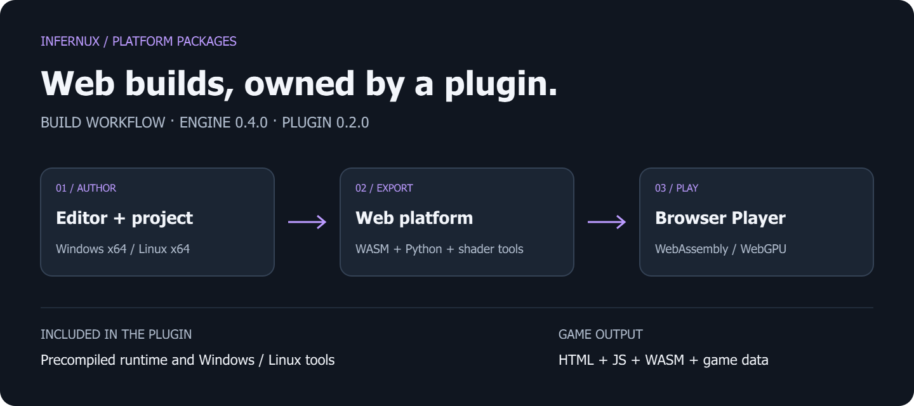

# Infernux Web 平台插件

[English](README.md) · [发布制品](https://github.com/ChenlizheMe/infernux_web/releases) · [Infernux](https://github.com/ChenlizheMe/Infernux)



通过编译为 WebAssembly 的 CPython 3.13 和 WebGPU 渲染构建浏览器 Player。插件包含预编译 WASM/JavaScript、CPython 标准库和 Windows/Linux 原生着色器工具，并提供浏览器宿主、输入桥接和项目 HTML 模板。

## 基本信息

| 项目 | 内容 |
| --- | --- |
| 包标识 | `infernux/platform-web` |
| 插件版本 | 0.2.0 |
| 引擎兼容范围 | ==0.4.0 |
| 构建目标 | `web-wasm32` |
| 构建宿主 | Windows x64 / Linux x64 |

## 安装

1. 在 Infernux 0.4.0 中打开项目，进入插件面板。
2. 在官方列表选择 Infernux Web Platform，导入并启用。
3. 打开构建设置，选择目标，按诊断补齐依赖后导出。

如果编辑器仍使用旧版内置目录，可以手动添加 GitHub 源 `https://github.com/ChenlizheMe/infernux_web`，或从 [Releases](https://github.com/ChenlizheMe/infernux_web/releases/latest) 下载 `infernux.platform-web.inxpkg` 后导入。GitHub 自动生成的源码 ZIP 是作者仓库，不是插件安装制品。

## 环境要求

Infernux 0.4.0，Windows x64 或 Linux x64 编辑器，以及支持 WebGPU 的浏览器。普通导出不需要引擎源码、Git 子模块、CMake、WSL 或 Emscripten。

## 插件载荷

`editor/infernux_web/player/` 存放预编译运行时和 CPython 数据；`tools/windows-x64/`、`tools/linux-x64/` 存放 glslang 和 Tint。安装插件即可使用，无需另外下载 Web SDK。

导出只处理项目内容、将 GLSL 转为 WGSL、封装 `.inxpkg` 并生成网页，不重新编译引擎。游戏内容进入二进制包，浏览器加载后在内存中挂载，HTTP 目录不暴露 Assets、Library 或项目源码树。

## 导出与访问

构建设置中选择 web-wasm32。发布整个输出目录，包括 infernux-player.html、JavaScript、WebAssembly 和游戏数据。本机测试使用 localhost HTTP，部署使用 HTTPS，不要通过 file:// 打开页面。浏览器权限和设备能力必须允许 WebGPU。

## 项目 Web 模板

将 package/editor/infernux_web/templates/host/shell.html 复制为项目 ProjectSettings/WebTemplate/shell.html。可以调整样式、元数据和外围页面，但须保留运行时标记与画布集成。其他模板资源导出到 web-template/，保持相对目录关系。

模板目录一旦存在就必须包含 shell.html。重新构建会替换生成内容，应编辑项目模板源文件而不是导出文件。游戏 UI 使用 Infernux Screen UI，HTML 是页面宿主，不是游戏的 DOM 渲染层。

## 排错

若提示插件载荷缺失或引擎版本不兼容，请显式选择匹配版本的完整 `.inxpkg`，不要安装 GitHub 源码归档。浏览器无法初始化 WebGPU 时，检查浏览器、设备支持和 GPU 设置；不存在 WebGL 渲染兜底。

## 开发与打包

只有 `package/` 内的内容进入 InxPackage。外层 README、SVG 配图源文件、发布流程和构建脚本属于仓库，不进入插件。引擎内文档独立位于 `package/plugin_pages/`。

```text
package/
  inx_package.json
  editor/infernux_web/
  plugin_pages/
package.py
release.py
README.md
README.zh-CN.md
```

运行 `python package.py dist/infernux.platform-web.inxpkg` 本地打包。脚本仅使用 Python 标准库，不需要导入或安装 Infernux。在外层进行构建，最后将需要交付的文件放进 package/ 即可。

维护者在外层 `native/` 构建：CMake 的 `prebuild_web_player` 和 `prebuild_web_tools` 直接将产物发布到插件目录。普通用户不执行这些构建。运行 `python release.py v0.2.0` 生成插件和发布清单；推送与插件版本一致的标签后，由 GitHub Actions 打包并上传两个文件。编辑器根据发布清单选择兼容版本。

## 许可证

[MIT](LICENSE)。第三方 SDK 和引擎运行时各自遵守原有许可证，不因本插件而改变。
